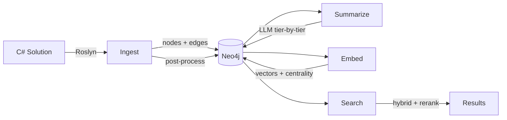
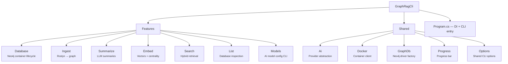

# Architecture

> *Generated from the code intelligence graph.*

GraphRagCli is a .NET CLI application that transforms C# codebases into Neo4j knowledge graphs by parsing source code with Roslyn, generating semantic embeddings, and enriching nodes with AI-powered summaries for retrieval-augmented generation workflows. The system provides semantic search capabilities by combining vector embeddings, full-text search, and graph topology analysis.

## Pipeline

Each stage reads from and writes back to Neo4j. All stages are incremental — only changed nodes get reprocessed. See [incremental updates](reference/incremental-updates.md) for how change detection works.

## Graph at a glance

| Metric | Count |
|--------|-------|
| Methods | 170 |
| Classes | 104 |
| Namespaces | 18 |
| Interfaces | 5 |
| Enums | 2 |
| Relationships | 543 |
| Tier depth | 0–11 |

## Project structure

Vertical slice architecture — each feature is self-contained, cross-cutting concerns live in `Shared/`.

Features never reference other Features — only Shared. The application bootstraps via `Program.cs` which registers all DI services through per-feature `Add*Services` extension methods:

| Entry point | What it registers |
|------------|-------------------|
| `AddDockerServices` | Docker client, Neo4j container client |
| `AddGraphDbServices` | Neo4j session factory |
| `AddAiServices` | Model config, kernel factory |
| `AddIngestServices` | MSBuild environment, code analyzer, ingest service |
| `AddSummarizeServices` | Prompt builder, summarize service |

## Pipeline stages

| Stage | What it does | Doc |
|-------|-------------|-----|
| **Ingest** | Roslyn parses C# → nodes + edges in Neo4j, then post-processes (stale cleanup, tier computation, labeling) | [ingest](pipeline/ingest.md) |
| **Summarize** | LLM generates summaries bottom-up through tiers, propagates dirty flags upward | [summarize](pipeline/summarize.md) |
| **Embed** | Vector embeddings from summaries, PageRank + degree centrality via GDS | [embed](pipeline/embed.md) |
| **Search** | Embed query → hybrid retrieval → RRF merge → graph expansion → centrality reranking | [search](pipeline/search.md) |
| **Database** | Neo4j Docker container init, adopt, list, schema setup | [database](pipeline/database.md) |

## Reference

| Topic | Doc |
|-------|-----|
| Node types, relationships, properties | [graph-schema](reference/graph-schema.md) |
| Change detection, dirty flag propagation, body hash transfer | [incremental-updates](reference/incremental-updates.md) |
| Provider config, models.json, searchText strategy | [model-configuration](reference/model-configuration.md) |
