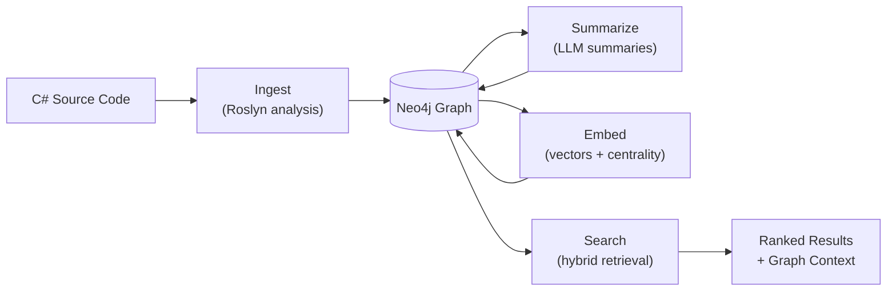
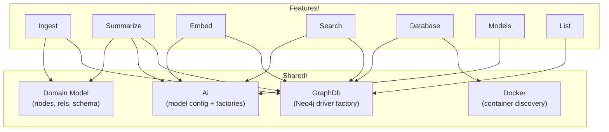

> *Generated from the code intelligence graph.*

# GraphRagCli Documentation

**Navigation:** **Overview** | [Design Decisions](design-decisions.md) | [Pipeline](pipeline/index.md) | [Platform](platform/index.md) | [CLI Reference](cli-reference.md)

---

GraphRagCli is a command-line tool that transforms C# codebases into queryable semantic knowledge graphs stored in Neo4j. It uses Roslyn static analysis, LLM-based summarization, and vector embeddings to enable hybrid fulltext/vector search with graph-based reranking.

## What's in the graph

The pipeline produces a typed property graph with 8 node types and 11 relationship types:

| Node types | Relationship types |
|---|---|
| Solution, Project, Namespace, Class, Interface, Enum, Method, Package | REFERENCES (297), CALLED_BY (208), DEFINED_BY (198), BELONGS_TO_NAMESPACE (128), BELONGS_TO_PROJECT (18), REGISTERS (15), IMPLEMENTS (13), IMPLEMENTS_METHOD (9), EXTENDS (7), CONTAINS_PROJECT (1), BELONGS_TO_SOLUTION (1) |

Nodes are further classified with semantic labels:

| Label | Count | Purpose |
|---|---|---|
| Embeddable | 326 | Eligible for vector embedding and search |
| PublicApi | 236 | Public-visibility elements for API surface analysis |
| EntryPoint | 5 | ASP.NET Core integration points (search ranking bonus) |

## How it works



Four pipeline stages enrich the graph incrementally. Each stage is a standalone CLI command that reads from and writes to Neo4j — the graph is the only communication channel between stages.

| Stage | What it produces | Details |
|---|---|---|
| [Ingest](pipeline/ingest.md) | Nodes, edges, tiers, body hashes | Roslyn semantic analysis of C# solutions |
| [Summarize](pipeline/summarize.md) | `summary`, `searchText`, `tags` | Tier-by-tier LLM summarization with map-reduce for oversized nodes |
| [Embed](pipeline/embed.md) | `embedding`, `pageRank`, `inDegree` | Vector embeddings + GDS centrality computation |
| [Search](pipeline/search.md) | Ranked results with graph context | Hybrid fulltext/vector retrieval with graph-based reranking |

The pipeline assigns hierarchical tiers via topological sort (with SCC handling). The current graph spans tiers 0–11, with 127 leaf nodes at tier 0 up to 1 root node at tier 11. Tiers drive summarization order — lower tiers are summarized first so their summaries inform parent nodes.

**Incremental by default.** SHA-256 body hashes detect changed source code. Only modified nodes are flagged with `needsSummary=true`, and the flag propagates upward through the graph. Re-running the pipeline after small code changes processes only the affected subgraph.

## Quick start

```bash
# 1. Provision a Neo4j container
graphragcli database init --name my-project

# 2. Ingest a C# solution
graphragcli ingest ./MySolution.sln -d my-project --skip-tests

# 3. Generate AI summaries
graphragcli summarize -d my-project

# 4. Create vector embeddings
graphragcli embed -d my-project

# 5. Search the knowledge graph
graphragcli search "how does authentication work" -d my-project
```

See the [CLI Reference](cli-reference.md) for all commands, flags, and example outputs.

## Architecture

GraphRagCli follows a **vertical slice architecture**. Each pipeline stage and management feature lives under `Features/` as a self-contained slice with its own handler, service, and repository. Cross-cutting infrastructure lives under `Shared/`.



Features never reference other features — only `Shared/`. See [Platform & Infrastructure](platform/index.md) for details on the shared subsystems and [Design Decisions](design-decisions.md) for the reasoning behind these choices.

## Most connected types

The graph's PageRank scores reveal the most structurally important types — the ones that everything else depends on:

| Type | PageRank | Role |
|---|---|---|
| `CodeSyntaxWalker` | 2.22 | Roslyn syntax tree walker that extracts all code entities |
| `IGraphNode` | 1.69 | Interface contract for all graph node records |
| `Neo4jContainerClient` | 1.12 | Docker container discovery and connection resolution |
| `INodeSummarizer` | 1.08 | Pluggable summarization abstraction (concurrent + batch) |
| `IPromptBuilder` | 0.89 | Transforms graph nodes into LLM-ready prompts |

## Documentation sections

| Section | What it covers |
|---|---|
| [Pipeline](pipeline/index.md) | The four processing stages: [ingest](pipeline/ingest.md), [summarize](pipeline/summarize.md), [embed](pipeline/embed.md), [search](pipeline/search.md) |
| [Platform & Infrastructure](platform/index.md) | [Database provisioning](platform/database.md), [AI model configuration](platform/ai-models.md), [graph domain model](platform/graph-model.md), DI bootstrap |
| [Design Decisions](design-decisions.md) | Cross-cutting architectural choices and trade-offs |
| [CLI Reference](cli-reference.md) | Complete command reference with flags, examples, and sample output |
