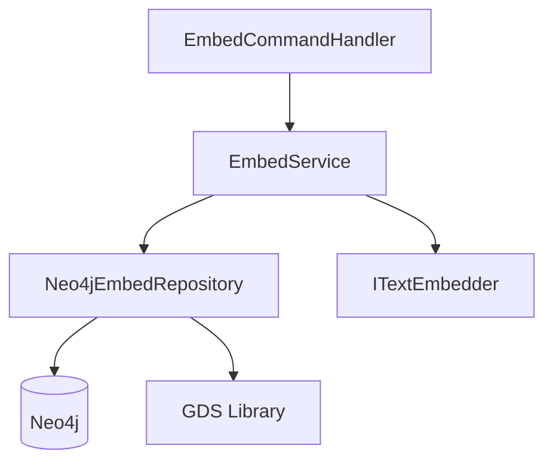

> *Generated from the code intelligence graph.*

# Embed

The embed stage converts AI-generated summaries into vector embeddings and computes graph centrality scores. These enable the [search](search.md) stage to perform semantic similarity queries and rank results by structural importance.

[Back to Pipeline overview](index.md)

## Architecture

The embed stage has the simplest architecture of the four pipeline stages: a command handler, a service, a repository, and an external text embedder.

## How it works

### 1. Schema validation

Before embedding, `Neo4jEmbedRepository.EnsureVectorIndexAsync` validates that a `code_embeddings` vector index exists with the correct dimensionality. If the embedding model changes and dimensions differ from the existing index, the index is dropped and all existing embeddings are cleared to prevent schema mismatches. A new index is created with cosine similarity.

### 2. Node retrieval

`GetNodesWithSummariesAsync` fetches nodes labeled `Embeddable` that have non-empty summaries and are either flagged `needsEmbedding=true` or forced for re-embedding. Each node is returned as an `EmbeddableNode` record carrying the node's ID, full name, summary, search text, and tags.

### 3. Concurrent embedding

`EmbedService.EmbedNodesAsync` generates embeddings concurrently with configurable parallelism (default: 4 concurrent tasks). Key design decisions:

- **Per-node failure isolation** -- Each embedding task is wrapped in error handling so a single failure does not halt the batch. Failed nodes are counted and logged but processing continues.
- **SemaphoreSlim gating** -- Concurrency is controlled via semaphore rather than fixed-size task pools, allowing dynamic throughput adjustment.
- **Real-time progress** -- CLI progress bars update atomically using `Interlocked` operations.
- **Text selection** -- Each node's `searchText` is used for embedding when available, falling back to `summary`.

### 4. Batch persistence

`SetEmbeddingsBatchAsync` persists computed vectors to Neo4j in **batches of 50**. This batching avoids Cypher parameter bloat while maintaining reasonable throughput.

### 5. Graph metadata

After embedding, `SetGraphMetaAsync` stores the embedding model name and vector dimensions on a `_GraphMeta` node. This metadata is read by the [search](search.md) stage to instantiate a compatible text embedder for query-time embedding.

### 6. Centrality computation

`ComputeCentralityAsync` uses Neo4j's Graph Data Science (GDS) library to compute two centrality metrics on the code dependency graph:

| Metric | What it measures | How search uses it |
|---|---|---|
| **PageRank** | Recursive importance based on incoming references | Up to 0.05 bonus in search scoring |
| **In-degree** | Direct incoming reference count | Available for filtering and ranking |

Centrality computation gracefully degrades when the GDS plugin is unavailable -- the rest of the pipeline continues without centrality scores. The implementation handles stale graph projections by catching and ignoring cleanup failures on first runs.

## Data model additions

The embed stage adds the following to each processed node:

| Property | Type | Description |
|---|---|---|
| `embedding` | `float[]` | Vector representation for cosine similarity search |
| `pageRank` | `float` | PageRank centrality score |
| `inDegree` | `int` | Count of incoming references |
| `needsEmbedding` | `bool` | Reset to `false` after embedding |

It also creates a Neo4j vector index (`code_embeddings`) for efficient approximate nearest-neighbor search.
