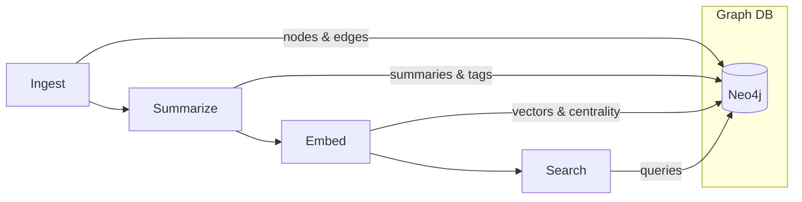

> *Generated from the code intelligence graph.*

# The Pipeline

GraphRagCli transforms C# source code into a searchable knowledge graph through a four-stage pipeline. Each stage is a self-contained vertical slice under `Features/`, communicating only through the Neo4j graph database.

## Pipeline stages

| Stage | Command | What it does | Key types |
|---|---|---|---|
| [Ingest](ingest.md) | `ingest` | Parses C# solutions with Roslyn, builds a code graph in Neo4j | `IngestService`, `CodeAnalyzer`, `Neo4jIngestRepository` |
| [Summarize](summarize.md) | `summarize` | Generates AI summaries for every graph node, tier by tier | `SummarizeService`, `PromptBuilder`, `ClaudeBatchSummarizer` |
| [Embed](embed.md) | `embed` | Creates vector embeddings from summaries, computes centrality scores | `EmbedService`, `Neo4jEmbedRepository` |
| [Search](search.md) | `search` | Hybrid fulltext + vector search with graph-based reranking | `SearchService`, `Neo4jSearchRepository` |

## Data flow

Each stage enriches the graph with new properties, building on what the previous stage produced:

| Stage | Reads from graph | Writes to graph |
|---|---|---|
| Ingest | (nothing) | Nodes (Solution, Project, Namespace, Class, Interface, Enum, Method), edges (EXTENDS, IMPLEMENTS, CALLED_BY, REFERENCES, REGISTERS, DEFINED_BY), `bodyHash`, `sourceText`, `tier` |
| Summarize | `sourceText`, `tier`, `needsSummary` | `summary`, `searchText`, `tags`, `needsEmbedding` |
| Embed | `summary`, `searchText`, `needsEmbedding` | `embedding` (vector), `pageRank`, `inDegree`, Embeddable label |
| Search | `embedding`, `pageRank`, `summary`, `searchText` | (nothing) |

## Incremental processing

The pipeline supports incremental re-runs. Ingest uses SHA-256 body hashes to detect changed source code and only flags modified nodes with `needsSummary=true`. Summarize processes only flagged nodes and propagates the flag upward to parent nodes. Embed processes only nodes marked `needsEmbedding=true`. This means re-running the pipeline after small code changes processes only the affected subgraph.

## Stage independence

Each stage is a standalone CLI command. You can re-run `summarize` without re-ingesting, or re-run `embed` without re-summarizing. The stages share no in-memory state -- the graph is the only communication channel.
