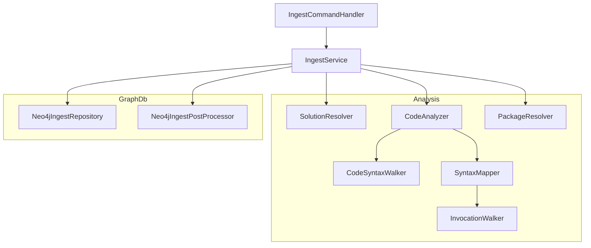
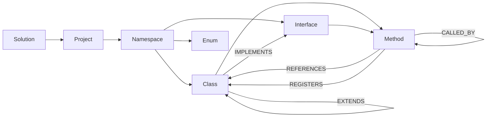

> *Generated from the code intelligence graph.*

# Ingest

The ingest stage parses C# solutions using Roslyn's semantic analysis and populates a Neo4j graph with code entities and their relationships. It is the foundation of the entire pipeline -- all downstream stages operate on the graph it produces.

[Back to Pipeline overview](index.md)

## Architecture

## How it works

### 1. Solution resolution

`SolutionResolver` locates the target codebase from user input. It accepts a direct file path or searches a directory using a two-phase strategy: top-level files first (prioritizing `.slnx` > `.sln` > `.csproj`), then recursive subdirectory search if needed.

### 2. Code analysis with Roslyn

`CodeAnalyzer` implements `ICodeAnalyzer` to extract architectural metadata from C# solutions. The analysis flow:

1. Loads the solution via `MSBuildWorkspace`
2. Filters out test and sample projects by naming convention and metadata references (xunit, nunit, mstest, BenchmarkDotNet)
3. Iterates each project's syntax trees, skipping build artifacts (`obj/`, `bin/`)
4. Delegates to `CodeSyntaxWalker` for per-file traversal

**CodeSyntaxWalker** is a Roslyn `CSharpSyntaxWalker` that extracts:

| Entity | What it captures |
|---|---|
| Namespaces | Fully qualified names, file paths |
| Classes / Structs / Records | Name, namespace, visibility, base types, interfaces, source text |
| Interfaces | Name, namespace, visibility, inheritance, source text |
| Enums | Name, namespace, visibility, members |
| Methods | Signature, visibility, return type, parameters, source text |
| Call graph | Method-to-method invocation edges |
| Type references | Cross-type dependencies and DI registrations |

A notable design decision: C# 9+ top-level statements are handled by synthesizing a `Program` class with a `Main()` method wrapper, then walking those statements to extract invocations and references.

**SyntaxMapper** converts Roslyn symbols into normalized domain objects (`ClassInfo`, `InterfaceInfo`, `MethodInfo`, etc.). Key filtering decisions:
- Base classes exclude implicit `System.Object` and `System.ValueType` -- only user-defined inheritance is captured
- Type references filter out primitive types (`SpecialType.None`) to focus on domain-meaningful connections
- `InvocationWalker` detects DI registration hubs (`IServiceCollection`, `IApplicationBuilder`, `IEndpointRouteBuilder`, etc.) and tags generic type arguments as "registration" context, enabling downstream analysis of service wiring

### 3. NuGet package resolution

`PackageResolver` loads project files via MSBuild, filters for packable projects (`IsPackable=true`), and builds a dictionary of PackageId to contributing project names. These become `Package` nodes in the graph.

### 4. Graph population

`Neo4jIngestRepository` bulk-loads analysis results into Neo4j using parameterized Cypher `MERGE`/`UNWIND` queries in **batches of 100**. It creates nodes for all entity types and edges for all relationship types.

**Change detection:** Each node's source text is hashed with SHA-256 (`bodyHash`). When source code differs from the previously stored version, the node is flagged with `needsSummary=true`, triggering downstream re-summarization. Unchanged nodes keep their existing summaries and embeddings.

**Idempotent upserts:** All operations use `MERGE` with `lastIngestedAt` timestamps, enabling incremental re-ingestion without full graph rebuilds.

### 5. Post-processing

`Neo4jIngestPostProcessor` runs a sequence of reconciliation and labeling steps after graph population:

#### Reconciliation
1. **Metadata transfer** -- Matches stale nodes to fresh ones via `bodyHash`. When a symbol is renamed or moved but its body is unchanged, the computed enrichments (summary, searchText, tags, embedding) transfer to the new node without re-computation.
2. **Stale cleanup** -- Deletes edges and nodes with outdated `lastIngestedAt` timestamps
3. **Dependency invalidation** -- Marks dependent nodes as stale when upstream dependencies change, incrementally invalidating cached embeddings

#### Semantic labeling
- **Embeddable** -- Labels nodes that should receive vector embeddings
- **EntryPoint** -- Identifies ASP.NET Core extension methods (types extending `IApplicationBuilder`, `IEndpointRouteBuilder`, etc.)
- **PublicApi** -- Labels public interfaces, classes, enums, and methods; conditionally filters by NuGet project membership when packages are present

#### Tier computation
Computes hierarchical tiers using Neo4j Graph Data Science (GDS):
1. Detects strongly connected components (SCCs) to handle dependency cycles
2. Runs topological sort on the dependency graph
3. Assigns tiers bottom-up: leaf nodes get tier 0, each node gets `max(child tiers) + 1`
4. Cycles are grouped into SCCs and assigned tiers iteratively once all non-SCC children resolve

Tiers drive the order of summarization in the next pipeline stage -- lower tiers (leaf nodes) are summarized first so their summaries can inform parent node summarization.

## Data model

The ingest stage creates the following graph schema:

## DI registration

`IngestSetup` registers the analysis pipeline as singletons:

| Service | Implementation |
|---|---|
| `SolutionResolver` | `SolutionResolver` |
| `PackageResolver` | `PackageResolver` |
| `ICodeAnalyzer` | `CodeAnalyzer` |
| `IngestService` | `IngestService` |
