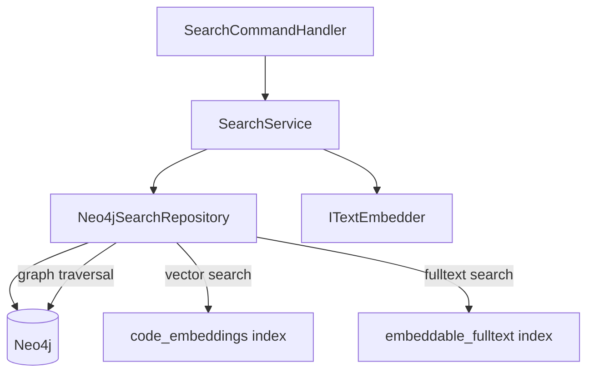

> *Generated from the code intelligence graph.*

# Search

The search stage provides semantic code retrieval by combining vector similarity, fulltext indexing, and graph-based reranking. It is the query-time consumer of everything the previous stages produced: summaries, embeddings, centrality scores, and graph structure.

[Back to Pipeline overview](index.md)

## Architecture



## Search modes

`SearchMode` controls the retrieval strategy:

| Mode | How it works |
|---|---|
| **Hybrid** | Fuses fulltext and vector search results via Reciprocal Rank Fusion (RRF), then reranks with graph signals |
| **Vector** | Pure semantic search via embeddings, then reranks with graph signals |

Both modes apply the same graph-based reranking after initial candidate retrieval.

## How it works

### 1. Query embedding

The natural language query is embedded using the same model that produced node embeddings (model info is read from the `_GraphMeta` node created during [embed](embed.md)). This ensures vector compatibility.

### 2. Candidate retrieval

The system retrieves **2x topK** candidates to allow reranking headroom.

**Vector search** (`SemanticSearchAsync`) queries the `code_embeddings` Neo4j vector index using cosine similarity, with optional label filtering to restrict results to specific node types (Class, Interface, Method, etc.).

**Fulltext search** (`FulltextSearchAsync`) queries the `embeddable_fulltext` Lucene index, with special-character escaping to prevent query injection. Results are filtered to Class, Interface, Method, Enum, Namespace, and Project node types.

### 3. Reciprocal Rank Fusion (hybrid mode)

In hybrid mode, fulltext and vector results are fused using RRF scoring:

```
score = 0.5 / (k + rank)    where k = 20
```

Both sources are weighted equally. The constant k=20 dampens the influence of rank position, preventing the top result from dominating.

### 4. Graph expansion and reranking

After initial retrieval, `GraphExpandAndRerankAsync` enriches results with graph signals:

1. **Neighbor expansion** -- For each candidate, `GetNeighborsAsync` traverses first-degree relationships to discover connected symbols with their relationship metadata
2. **Graph bonus** -- +0.02 per neighbor shared with other candidates in the result set, rewarding structurally connected code
3. **Centrality bonus** -- Up to +0.05 scaled from PageRank score, surfacing foundational types
4. **Entry point bonus** -- +0.10 for nodes labeled `EntryPoint`, boosting API surface visibility

The composite score combines semantic relevance (from vector/fulltext) with structural importance (from graph signals), producing a ranking that balances "what the query means" with "what matters in the codebase."

### 5. Result presentation

`SearchCommandHandler` formats results in tabular console output showing:
- Type name and labels
- Method signatures with return types and parameters
- Truncated summaries (max 60 characters)
- Search text snippets
- Up to 3 neighboring graph nodes with relationship types

## Repository layer

`Neo4jSearchRepository` implements `ISearchRepository` with these key behaviors:

| Method | Purpose | Details |
|---|---|---|
| `SemanticSearchAsync` | Vector similarity search | Converts `float[]` to `double` for Neo4j compatibility; queries `code_embeddings` index |
| `FulltextSearchAsync` | Lucene fulltext search | Escapes special characters; queries `embeddable_fulltext` index |
| `GetNeighborsAsync` | First-degree graph traversal | Returns `NeighborInfo` records with name, summary, relationship type, and full name |

All methods return `SearchResult` objects enriched with structural metadata (namespace, file path, parameters, return type) and graph metrics (PageRank, tier).

## Scoring breakdown

| Signal | Weight | Source |
|---|---|---|
| Semantic similarity | Base score | Vector index cosine distance |
| Fulltext relevance | Base score (hybrid only) | Lucene score, fused via RRF |
| Shared neighbors | +0.02 each | Graph traversal |
| PageRank centrality | Up to +0.05 | GDS computation from [embed](embed.md) stage |
| Entry point status | +0.10 | Label from [ingest](ingest.md) stage |
