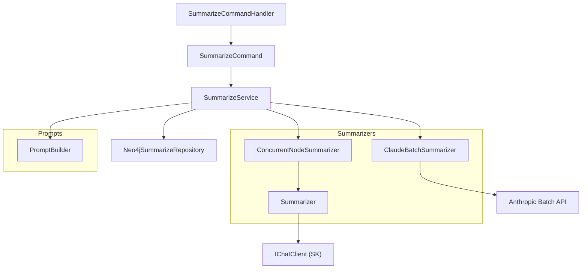

> *Generated from the code intelligence graph.*

# Summarize

The summarize stage enriches code graph nodes with AI-generated natural language summaries, semantic tags, and search-optimized text. It processes nodes tier-by-tier (bottom-up) so that leaf nodes are summarized before their parents, allowing parent summaries to incorporate child context.

[Back to Pipeline overview](index.md)

## Architecture

## How it works

### 1. Model resolution and validation

`SummarizeCommand` validates the AI model configuration before processing begins. It loads model config from `models.json`, enforces that Claude provider is required for batch mode, and resolves concurrency settings per model.

### 2. Tier-by-tier processing

`SummarizeService` fetches nodes grouped by architectural tier (computed during [ingest](ingest.md)), starting from tier 0 (leaf nodes) and working upward. This ordering ensures that when a namespace or project node is summarized, all its child types already have summaries that can be included as context.

For each tier:

1. Fetch nodes marked with `needsSummary=true` from `Neo4jSummarizeRepository`
2. Build AI-ready prompts via `PromptBuilder`
3. Detect oversized nodes and handle them with map-reduce
4. Submit to either concurrent or batch summarizer
5. Persist results back to Neo4j in batches of 50

### 3. Prompt construction

`PromptBuilder` transforms code graph nodes into `EmbeddableNode` records containing structured prompts. Each prompt includes:

- **Type-specific content** -- Method signatures, class hierarchies, interface contracts, enum definitions, namespace/project structures
- **Relational metadata** -- Calls, implementations, references, and dependents wrapped in XML-style `<CONTEXT>` tags
- **System instructions** -- Strict constraints enforcing no filler language, literal code values, avoidance of syntax descriptions, and 1-3 semantic tags from a predefined set

The prompt builder dispatches on node type via switch expressions, invoking type-specific content builders (`BuildMethodContent`, `BuildClassContent`, `BuildInterfaceContent`, etc.) with type-specific guidance:

| Node type | Instruction focus |
|---|---|
| Method | Algorithm, data flow, side effects |
| Class | Responsibility, collaboration patterns |
| Interface | Contract, implementations, design patterns |
| Namespace | Synthesize children into cohesive narrative |
| Project/Solution | High-level purpose and architecture |

**Semantic tags** are drawn from a fixed set: CORE, API, DATABASE, CONFIGURATION, UTILITY, INTEGRATION, MESSAGING, CACHING, SECURITY, WORKER, TESTING, UI.

### 4. Map-reduce for oversized nodes

Nodes whose content exceeds `MaxPromptChars` are processed with a map-reduce pattern:

1. **Map** -- Split content by line boundaries into fixed-size chunks, each becoming its own `EmbeddableNode`
2. **Summarize** -- Each chunk is summarized independently
3. **Reduce** -- Chunk summaries are assembled into a synthetic parent `NamespaceNode` and summarized again to produce a final architectural overview

This allows processing nodes that exceed LLM token limits while preserving architectural context.

### 5. Summarization strategies

The `INodeSummarizer` interface defines pluggable summarization backends. `SummarizeService` selects the strategy based on batch size:

#### ConcurrentNodeSummarizer
- Used for smaller workloads or non-Claude providers
- Enforces concurrency limits via `SemaphoreSlim`
- Implements exponential backoff retry (2s, 4s, 6s delays, up to 2 attempts)
- Thread-safe progress tracking with real-time CLI rendering

#### ClaudeBatchSummarizer
- Activated when batch count reaches 100+ prompts
- Chunks nodes into batches of up to 1000
- Submits to the Anthropic Claude Batch API with enforced JSON schema output
- Polls for completion at 10-second intervals
- Tracks token usage and estimates cost with 50% batch discount
- Maps internal batch IDs back to original nodes for traceability

Both strategies use `Summarizer` as the underlying LLM interaction layer, which sends prompts via `IChatClient`, enforces JSON schema validation on responses (`ResponseFormat.ForJsonSchema<SummaryResult>()`), and validates non-empty summaries with uppercase tag normalization.

### 6. Persistence and propagation

`Neo4jSummarizeRepository` handles graph I/O for the summarization pipeline:

- **Retrieval** -- `GetTierNodesAsync` fetches paginated nodes at a given tier with full incoming/outgoing relationship context via nested Cypher `CALL` subqueries
- **Persistence** -- `SetSummariesBatchAsync` writes summaries, tags, and search text in batches of 50, marking embeddable nodes for downstream embedding
- **Propagation** -- After persisting, flags parent nodes with `needsSummary=true` so that parent summaries are regenerated when children change
- **Polymorphic mapping** -- `MapToTypedNode` deserializes raw Neo4j records into strongly-typed domain objects (`MethodNode`, `ClassNode`, `InterfaceNode`, etc.) by inspecting node labels

### Output properties

Each summarized node receives:

| Property | Description |
|---|---|
| `summary` | Natural language description of the node's purpose and behavior |
| `searchText` | First two sentences of the summary, optimized for keyword-dense retrieval |
| `tags` | 1-3 semantic labels from the predefined set |
| `needsEmbedding` | Flag set to `true` for embeddable nodes, triggering the [embed](embed.md) stage |

## DI registration

`SummarizeSetup` registers:

| Service | Implementation |
|---|---|
| `IPromptBuilder` | `PromptBuilder` |
| `SummarizeService` | `SummarizeService` |
