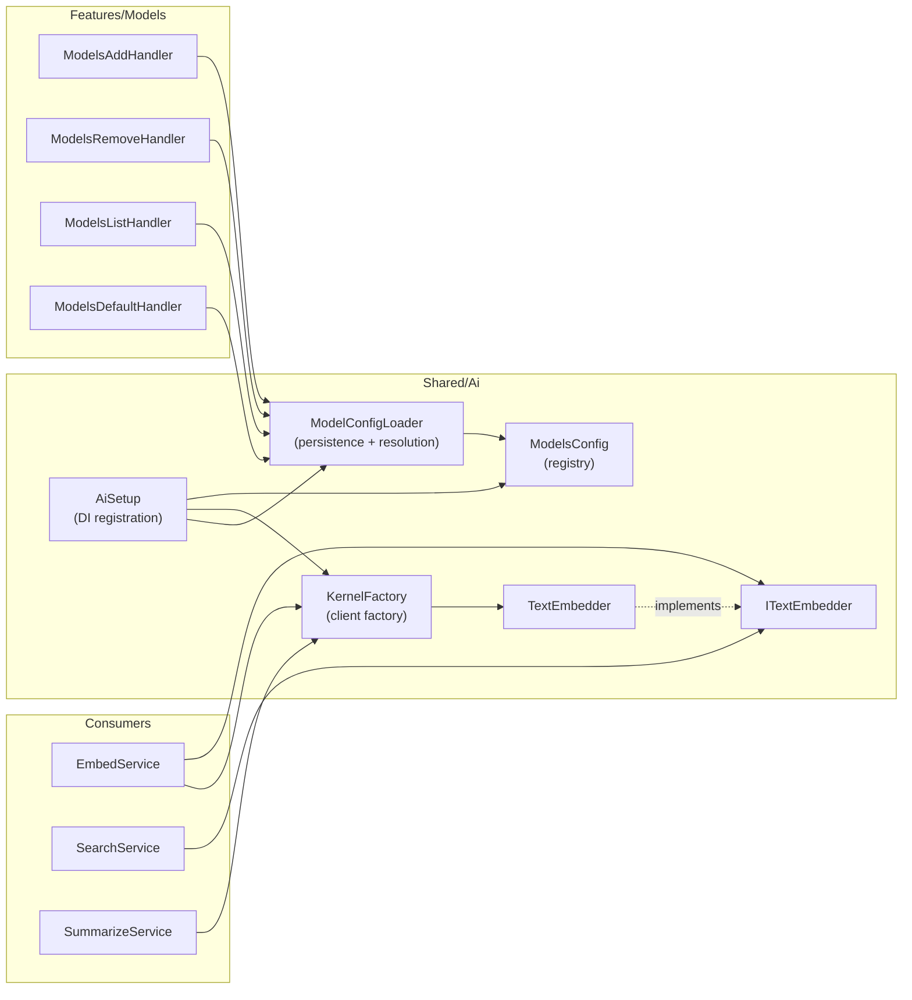

> *Generated from the code intelligence graph.*

# AI & Model Configuration

GraphRagCli abstracts over multiple LLM backends for two distinct tasks: generating vector embeddings (for semantic search) and summarizing code nodes (for the intelligence graph). The AI subsystem provides a pluggable model registry, provider-specific client factories, and CLI commands for managing model configurations.

## Architecture



## Model configuration

Models are configured in `~/.graphragcli/models.json`. The file holds two model categories and a defaults section:

```
ModelsConfig
  +-- Embedding: Dictionary<string, EmbeddingModelConfig>
  +-- Summarize: Dictionary<string, SummarizeModelConfig>
  +-- Defaults: ModelDefaults (which embedding + summarize model to use by default)
```

**EmbeddingModelConfig** captures:
- `Provider` -- the LLM backend (currently `ollama`)
- `Dimensions` -- vector dimensionality (e.g., 768, 1024)
- `DocumentPrefix` / `QueryPrefix` -- optional text prefixes prepended before vectorization. This is a key RAG pattern where query and document embeddings benefit from distinct preprocessing strategies.

**SummarizeModelConfig** captures:
- `Provider` -- the LLM backend (`ollama` or `claude`)
- `MaxPromptChars` -- character limit for prompts, used to chunk oversized nodes
- `Concurrency` -- parallel summarization threads
- `SearchTextStrategy` -- controls whether search text is extracted from the first two sentences of the summary (`FirstTwoSentences`) or generated separately (`Separate`)

### Loading and fallback

`ModelConfigLoader.Load()` reads from `~/.graphragcli/models.json`. If the file doesn't exist, it falls back to embedded assembly defaults baked into the binary. On first load, it also persists the defaults to disk so the user has a file to customize.

Model resolution follows a name-with-fallback pattern: `ResolveEmbeddingModelName(config, userProvided?)` returns the user-provided name if it exists in the registry, otherwise returns the default. `GetEmbeddingModel()` and `GetSummarizeModel()` combine resolution with dictionary lookup.

### Provider-specific validation

`ValidateSummarizeOptions()` enforces constraints: batch mode is only valid for the `claude` provider (since it uses the Anthropic Batch API). Non-Claude providers attempting batch mode get a validation error.

## KernelFactory -- client instantiation

`KernelFactory` is the single place where AI clients are created. It supports two providers:

```csharp
public class KernelFactory(string ollamaUrl = "http://localhost:11434")
{
    public ITextEmbedder CreateTextEmbedder(string embeddingModel, EmbeddingModelConfig config)
    {
        var client = new OllamaApiClient(new Uri(ollamaUrl)) { SelectedModel = embeddingModel };
        return new TextEmbedder(client, config.DocumentPrefix, config.QueryPrefix);
    }

    public Summarizer GetSummarizer(SummarizeModelConfig config, string model)
    {
        var chatClient = CreateChatClient(config.Provider);
        return new Summarizer(chatClient, model);
    }

    private IChatClient CreateChatClient(string provider) => provider switch
    {
        "ollama" => new OllamaApiClient(...),
        "claude" => new AnthropicClient().Beta.AsIChatClient("claude-haiku-4-5-20251001"),
        _ => throw new NotSupportedException($"Unknown provider: {provider}")
    };
}
```

Key design decisions:
- **Ollama for embeddings** -- embedding always goes through Ollama's `OllamaApiClient`, which supports configurable model selection
- **Provider switch for summarization** -- Ollama gets a 5-minute HTTP timeout for long completions; Claude uses the Anthropic SDK's `IChatClient` adapter
- **Registered as singleton** -- one factory instance shared across the application lifetime

## Text embedding abstraction

`ITextEmbedder` defines the contract for vector embedding with two methods:

| Method | Used by | Prefix applied |
|---|---|---|
| `EmbedDocumentAsync(text)` | `EmbedService` (batch node embedding) | `DocumentPrefix` |
| `EmbedQueryAsync(text)` | `SearchService` (query-time embedding) | `QueryPrefix` |

The prefix separation matters for retrieval quality. Some embedding models (like `nomic-embed-text`) perform better when documents and queries are tagged differently. The `TextEmbedder` implementation wraps an `IEmbeddingGenerator` and prepends the configured prefix before vectorization.

## Model management CLI

The `models` command group provides four subcommands for managing AI model configurations:

| Command | Handler | What it does |
|---|---|---|
| `models add` | `ModelsAddHandler` | Registers a new model with type-specific validation |
| `models remove` | `ModelsRemoveHandler` | Removes a model (blocks removal of defaults) |
| `models list` | `ModelsListHandler` | Displays all models with provider, dimensions, concurrency |
| `models default` | `ModelsDefaultHandler` | Sets the default model for a category |

All handlers use `ModelConfigLoader.Load()` and `Save()` to read and persist changes to `models.json`. The `add` command validates required fields per model type -- embedding models require `dimensions`, summarize models require `max-prompt-chars`.

The `remove` command prevents deleting a model that is currently set as a default, requiring the user to assign a new default first.

## DI registration

`AiSetup.AddAiServices()` bootstraps the AI subsystem:

| What | Lifetime | How |
|---|---|---|
| `ModelsConfig` | Singleton | Loaded via `ModelConfigLoader.Load()` |
| `KernelFactory` | Singleton | Constructed with default Ollama URL |

## Key files

| Concern | Path |
|---|---|
| Model config records | `Shared/Ai/EmbeddingModelConfig.cs`, `SummarizeModelConfig.cs`, `ModelsConfig.cs` |
| Config persistence | `Shared/Ai/ModelConfigLoader.cs` |
| Client factory | `Shared/Ai/KernelFactory.cs` |
| Embedding abstraction | `Shared/Ai/ITextEmbedder.cs`, `TextEmbedder.cs` |
| DI setup | `Shared/Ai/AiSetup.cs` |
| CLI handlers | `Features/Models/ModelsAddHandler.cs`, `ModelsRemoveHandler.cs`, etc. |
