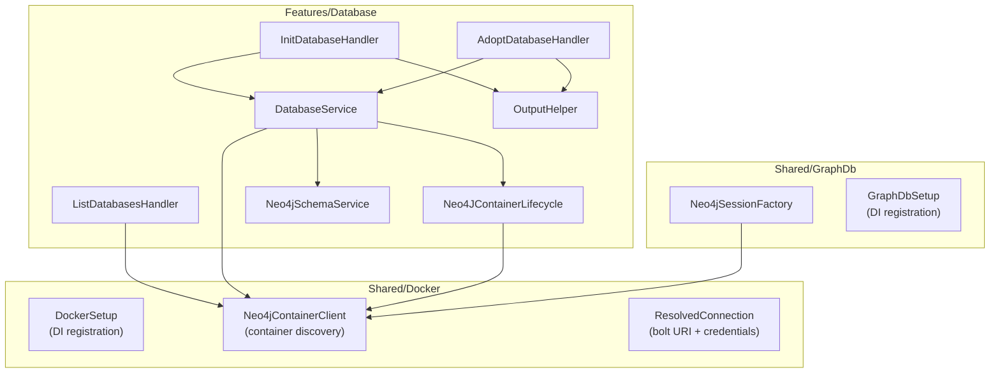
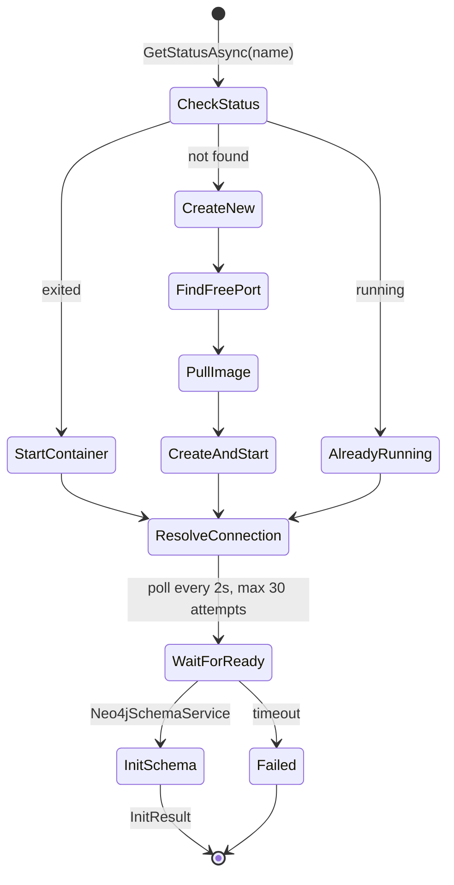

> *Generated from the code intelligence graph.*

# Database Provisioning

GraphRagCli manages Neo4j databases as Docker containers, handling the full lifecycle from image pull to schema initialization. Three layers collaborate: Docker client infrastructure discovers and inspects containers, the Database feature orchestrates provisioning, and the GraphDb layer creates Neo4j driver connections.

## Architecture

## Docker container discovery

`Neo4jContainerClient` is the central service for finding and inspecting Neo4j containers. It uses `Docker.DotNet` (not the Docker CLI) and tracks containers through two mechanisms:

1. **Label-based discovery** -- containers created by GraphRagCli are tagged with a `graphragcli` Docker label. `ByLabel()` queries the Docker daemon for these containers.
2. **Adoption registry** -- externally-created containers can be adopted. The registry is persisted as `~/.graphragcli/adopted.json`, a `HashSet<string>` of container names.

`CollectAllNamesAsync()` merges both sources to produce the complete set of managed containers.

Key operations:

| Method | Purpose |
|---|---|
| `ResolveAsync(name)` | Inspects a container, extracts Bolt port from 7687/tcp binding, parses `NEO4J_AUTH` env var for password, returns `ResolvedConnection` |
| `ListRunningAsync()` | Returns names of running containers (label-filtered) |
| `ListWithStatusAsync()` | Returns `Neo4jContainerInfo` for all managed containers with status and port |
| `GetStatusAsync(name)` | Returns container status string (running, exited, etc.) |
| `IsManagedAsync(name)` | Checks if a container is in the managed set |

Error handling is defensive -- `TryInspectAsync()` catches `DockerContainerNotFoundException` and returns null, allowing callers to handle missing containers gracefully. The default password is `"password123"` when `NEO4J_AUTH` is absent.

## Container lifecycle

`Neo4JContainerLifecycle` handles the Docker operations for creating and starting Neo4j containers:

- **Image pull** -- pulls `neo4j:latest` (parsed via `ParseImageRef`)
- **Container creation** -- configures NEO4J_AUTH, enables APOC and GDS plugins via environment variables (`NEO4J_PLUGINS`, `NEO4J_apoc_export_file_enabled`, etc.), sets `NEO4J_dbms_security_procedures_unrestricted` for full plugin access
- **Port binding** -- binds Bolt (7687) and HTTP (7474) to host ports
- **Persistent volumes** -- mounts data and plugins directories for durability
- **Dynamic port allocation** -- `FindFreePort(startPort)` scans from port 7687 upward using `TcpListener` to find an available port

## Database initialization flow

`DatabaseService.InitAsync()` orchestrates the full provisioning pipeline:

The three initialization paths return different `InitStatus` values:
- `AlreadyRunning` -- container was active, resolved connection immediately
- `Started` -- stopped container was restarted
- `Created` -- new container was provisioned from scratch
- `Failed` -- initialization error (timeout, Docker failure, etc.)

`WaitForReadyAsync()` polls connectivity by creating temporary `GraphDatabase.Driver` instances and calling `VerifyConnectivityAsync()`, swallowing exceptions until success or timeout.

## Container adoption

`DatabaseService.AdoptAsync()` integrates externally-managed Neo4j containers:

1. Validates the container exists via `GetStatusAsync()`
2. Checks it isn't already managed via `IsManagedAsync()`
3. Resolves Bolt port and credentials via `ResolveAsync()`
4. Persists the container name to `adopted.json`

This enables teams to use pre-existing Neo4j instances without GraphRagCli managing the Docker lifecycle.

## Schema initialization

`Neo4jSchemaService.InitializeAsync()` runs once during provisioning to set up:

- **Uniqueness constraints** on all eight node types keyed by `fullName` -- prevents duplicate code artifacts during ingestion
- **Fulltext index** on `Embeddable`-labeled nodes across `name`, `fullName`, and `searchText` fields -- enables efficient keyword-based search

## Neo4j driver factory

`Neo4jSessionFactory` creates verified Neo4j driver connections. It bridges Docker container discovery with Neo4j driver creation:

1. If a container name is provided, resolves it directly via `Neo4jContainerClient.ResolveAsync()`
2. If no name is given, auto-detects: lists running containers, and if exactly one exists, uses it. Multiple containers without a name throws `InvalidOperationException`
3. Constructs a `GraphDatabase.Driver` with the resolved `bolt://localhost:{port}` URI and basic auth
4. Verifies connectivity before returning. Disposes the driver on failure to prevent resource leaks

Every pipeline command (ingest, summarize, embed, search, list) calls `Neo4jSessionFactory.CreateDriverAsync()` to obtain a driver. The caller owns driver lifetime.

## CLI commands

The Database feature exposes three subcommands:

| Command | Handler | What it does |
|---|---|---|
| `database init` | `InitDatabaseHandler` | Provisions a new container, outputs MCP config |
| `database adopt` | `AdoptDatabaseHandler` | Adopts an existing container, outputs MCP config |
| `database list` | `ListDatabasesHandler` | Shows managed containers with status and ports |

Both `init` and `adopt` handlers call `OutputHelper.PrintMcpJson()` to generate a `.mcp.json` template with Neo4j connection environment variables (`NEO4J_URI`, `NEO4J_USERNAME`, `NEO4J_PASSWORD`, `NEO4J_DATABASE`, `NEO4J_TRANSPORT_MODE`), ready for Model Context Protocol integration.

## DI registration

| Setup class | Registers | Lifetime |
|---|---|---|
| `DockerSetup.AddDockerServices()` | `IDockerClient`, `Neo4jContainerClient` | Singleton |
| `GraphDbSetup.AddGraphDbServices()` | `Neo4jSessionFactory` | Singleton |
| `Program.Main()` | `Neo4JContainerLifecycle`, `DatabaseService` | Singleton |

## Key files

| Concern | Path |
|---|---|
| Container discovery | `Shared/Docker/Neo4jContainerClient.cs` |
| DI setup (Docker) | `Shared/Docker/DockerSetup.cs` |
| Container lifecycle | `Features/Database/Neo4JContainerLifecycle.cs` |
| Database orchestration | `Features/Database/DatabaseService.cs` |
| Schema initialization | `Features/Database/Neo4jSchemaService.cs` |
| Driver factory | `Shared/GraphDb/Neo4jSessionFactory.cs` |
| CLI handlers | `Features/Database/InitDatabaseHandler.cs`, `AdoptDatabaseHandler.cs`, `ListDatabasesHandler.cs` |
