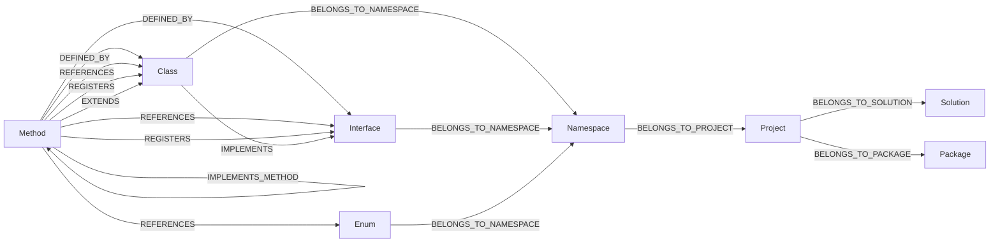

> *Generated from the code intelligence graph.*

# Graph Domain Model

The code intelligence graph represents C# codebases as a typed property graph in Neo4j. Every node and edge in the graph maps to a strongly-typed C# record or constant, giving the entire system compile-time safety over graph operations.

## Node hierarchy

The graph models eight levels of code structure, from coarse-grained containers down to individual methods:

| Node type | What it represents | Key relationships |
|---|---|---|
| `Solution` | A .sln file | Contains projects |
| `Project` | A .csproj | Belongs to solution, contains namespaces |
| `Package` | A NuGet package dependency | Projects belong to packages |
| `Namespace` | A C# namespace | Belongs to project, contains types |
| `Class` | A class definition | Belongs to namespace, implements interfaces |
| `Interface` | An interface definition | Belongs to namespace |
| `Enum` | An enum definition | Belongs to namespace |
| `Method` | A method or function | Defined by class/interface, calls other methods |

These are defined as string constants in `NodeType`:

```csharp
public static class NodeType
{
    public const string Method = nameof(Method);
    public const string Class = nameof(Class);
    public const string Interface = nameof(Interface);
    public const string Enum = nameof(Enum);
    public const string Namespace = nameof(Namespace);
    public const string Project = nameof(Project);
    public const string Package = nameof(Package);
    public const string Solution = nameof(Solution);

    public static readonly string[] All =
        [Method, Class, Interface, Enum, Namespace, Project, Package, Solution];
}
```

The `All` array drives iteration for schema initialization, constraint creation, Cypher filtering, and type-specific routing in summarization and ingestion.

## Relationship types

`RelType` defines two categories of edges:

**Structural (hierarchy)** -- containment relationships that form the code tree:

| Constant | Neo4j type | Meaning |
|---|---|---|
| `DefinedBy` | `DEFINED_BY` | Method belongs to a class/interface |
| `BelongsToNamespace` | `BELONGS_TO_NAMESPACE` | Type belongs to a namespace |
| `BelongsToProject` | `BELONGS_TO_PROJECT` | Namespace belongs to a project |
| `BelongsToSolution` | `BELONGS_TO_SOLUTION` | Project belongs to a solution |
| `BelongsToPackage` | `BELONGS_TO_PACKAGE` | Project depends on a package |
| `ContainsProject` | `CONTAINS_PROJECT` | Solution contains a project |

**Semantic** -- code-level relationships discovered by static analysis:

| Constant | Neo4j type | Meaning |
|---|---|---|
| `CalledBy` | `CALLED_BY` | Method A calls method B |
| `References` | `REFERENCES` | Method references a type |
| `Implements` | `IMPLEMENTS` | Class implements an interface |
| `ImplementsMethod` | `IMPLEMENTS_METHOD` | Method implements an interface method |
| `Extends` | `EXTENDS` | Method extends a class (extension method) |
| `InheritsFrom` | `INHERITS_FROM` | Class inherits from another class |
| `Registers` | `REGISTERS` | Method registers a type in DI |

## Graph schema and edge topology

`GraphSchema` declares every valid edge as an `EdgeDef(Source, RelType, Target)` triple. This serves as a contract that prevents incomplete relationship handling:



`GraphSchema.ValidateHandledRelTypes()` enforces that every prompt builder handles all incoming edge types for its node type. If a content builder for `Class` doesn't handle the `IMPLEMENTS` relationship, the system throws `InvalidOperationException` at runtime. This prevents silent data loss during summarization.

## Node labels

Beyond node types, three labels classify nodes for different pipeline stages:

| Label | Applied to | Purpose |
|---|---|---|
| `Embeddable` | Class, Interface, Method, Enum | Marks nodes eligible for vector embedding |
| `EntryPoint` | Extension methods | Identifies ASP.NET Core integration points |
| `PublicApi` | Public-visibility elements | Scopes API-level analysis and search ranking |

These labels are applied during ingestion post-processing and used throughout for Cypher filtering, fulltext/vector indexing, centrality computation, and search ranking bonuses.

## The IGraphNode contract

All node records implement `IGraphNode`, the minimal interface for graph participation:

```csharp
public interface IGraphNode
{
    NodeId Id { get; }
    string FullName { get; }
    List<string> Labels { get; }
    string? Summary { get; }
    string? SearchText { get; }
    string? BodyHash { get; }
}
```

`NodeId` is a strongly-typed wrapper around a string, preventing accidental mixing of different ID types. `BodyHash` enables change detection -- when a method's body changes, its SHA-256 hash (computed by `Hasher.HashCodeBody()`) differs from the stored value, triggering re-summarization.

## Typed node records

Each node type has a dedicated C# record that implements `IGraphNode` and carries type-specific relational collections:

| Record | Type-specific fields |
|---|---|
| `MethodNode` | Calls, CalledBy, Implements, References, Registers, Extends |
| `ClassNode` | Members, ReferencedBy, RegisteredBy, Extended, Implements, Namespace |
| `InterfaceNode` | Members, ImplementedBy, ReferencedBy, RegisteredBy, Namespace |
| `EnumNode` | Members, ReferencedBy, Namespace |
| `NamespaceNode` | Types, Project |
| `ProjectNode` | Namespaces, Solution |
| `SolutionNode` | Projects |

These records are populated by `Neo4jSummarizeRepository.MapToTypedNode()`, which deserializes raw Neo4j edges into strongly-typed `RelatedNode` collections based on `RelType` constants. The `PromptBuilder` then dispatches each record to a type-specific content builder that serializes it into LLM-ready markdown.

## Change detection

`Hasher` provides deterministic SHA-256 hashing for incremental updates:

- `Hash(string)` -- computes a hexadecimal SHA-256 digest of any string
- `HashCodeBody(string)` -- strips everything before the first `{` and after the last `}`, then hashes only the implementation block. This means renames and declaration changes don't trigger re-summarization, but body changes do.

## Key files

| Concern | Path |
|---|---|
| Node types | `Shared/NodeType.cs` |
| Relationship types | `Shared/RelType.cs` |
| Node labels | `Shared/NodeLabels.cs` |
| Graph schema | `Shared/GraphSchema.cs` |
| IGraphNode + records | `Shared/GraphNodes.cs` |
| Change detection | `Shared/Hasher.cs` |
