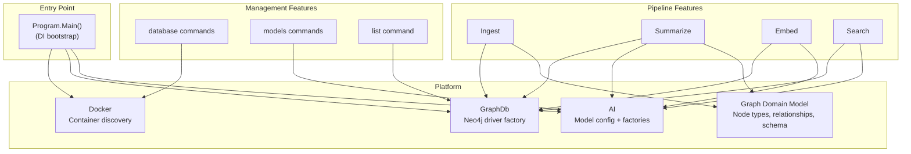

> *Generated from the code intelligence graph.*

# Platform & Infrastructure

This section covers everything that supports the GraphRagCli pipeline: database provisioning, AI provider abstraction, the graph domain model, and CLI infrastructure.

## How it fits together



## Application bootstrap

`Program.Main()` constructs a `CommandHost` with dependency injection, registering services in a specific order:

```csharp
services.AddDockerServices();    // IDockerClient, Neo4jContainerClient
services.AddGraphDbServices();   // Neo4jSessionFactory
services.AddAiServices();       // ModelsConfig, KernelFactory
services.AddIngestServices();    // Ingest pipeline
services.AddSummarizeServices(); // Summarize pipeline

services.AddSingleton<Neo4JContainerLifecycle>();
services.AddSingleton<DatabaseService>();
services.AddSingleton<EmbedService>();
```

The CLI uses a verb-based command parsing pattern where parameter records decorated with `[Verb]` attributes are mapped to handler classes that inherit from `BaseHandler<TParams>`.

## Pages in this section

| Page | What it covers |
|---|---|
| [Graph Domain Model](graph-model.md) | Node types, relationship types, schema topology, IGraphNode contract, typed node records, change detection |
| [Database Provisioning](database.md) | Docker container lifecycle, Neo4j initialization flow, container adoption, schema setup, driver factory |
| [AI & Model Configuration](ai-models.md) | Model registry, provider abstraction (Ollama/Claude), embedding strategy, CLI model management |

## Utilities

### DatabaseOption

`DatabaseOption` (`Shared/Options/DatabaseOption.cs`) is a `System.CommandLine` option aliased to `-d` that captures the database container name. When only one container is running, it auto-detects without requiring the flag.

### ProgressHelper

`ProgressHelper` (`Shared/Progress/ProgressHelper.cs`) renders console progress bars during long-running batch operations (summarization, embedding). It displays a visual bar, completion percentage, elapsed time, ETA (calculated from processing rate), and a truncated item name. Output is padded to console width with graceful fallback for non-interactive environments.

### List command

The `list` command (`Features/List/ListCommandHandler.cs`) provides a quick overview of what's in a database:

- **Solutions** indexed in the graph
- **Node counts** by label (Class, Method, Interface, etc.) with totals
- **Embedding coverage** -- ratio of embedded vs. embeddable nodes
- **Projects** with member counts and truncated summaries

It queries Neo4j via `Neo4jListRepository`, which runs four Cypher aggregation queries and returns a `DatabaseInfo` DTO for formatted terminal output.
