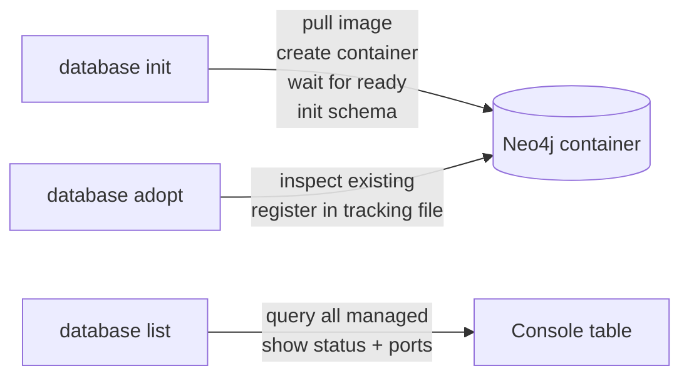

# Database

> *Generated from the code intelligence graph.*

Manages Neo4j Docker container lifecycle: creating new containers, adopting existing ones, listing managed instances, and initializing the graph schema. Uses Docker.DotNet for container orchestration with dynamic port allocation and credential management.

## Operations



### Init

Creates a new Neo4j container from scratch:

1. **Pull image** — downloads the Neo4j Docker image with GDS plugins
2. **Create container** — configures authentication, port bindings (Bolt + HTTP), volume mounts, and GDS plugin activation
3. **Wait for ready** — polls the Bolt endpoint until Neo4j responds
4. **Initialize schema** — creates uniqueness constraints on all node types and a fulltext search index

Outputs MCP configuration JSON for Claude Code integration:

```json
{
  "mcpServers": {
    "my-project": {
      "command": "neo4j-mcp",
      "env": {
        "NEO4J_URI": "bolt://localhost:7687",
        "NEO4J_USERNAME": "neo4j",
        "NEO4J_PASSWORD": "..."
      }
    }
  }
}
```

### Adopt

Registers an existing Neo4j container for management. Inspects the container to extract port mappings and credentials, then persists to a local tracking file.

### List

Displays all managed containers with status and Bolt port in a formatted console table.

## Schema initialization

`Neo4jSchemaService` creates the graph schema before any data is ingested:

| What | Cypher |
|------|--------|
| Uniqueness constraints | `CREATE CONSTRAINT IF NOT EXISTS FOR (n:Class) REQUIRE n.fullName IS UNIQUE` (for each node type) |
| Fulltext index | `CREATE FULLTEXT INDEX IF NOT EXISTS FOR (n:Class\|Method\|Interface\|Enum) ON EACH [n.fullName, n.summary]` |

The vector index is created later by the [embed](embed.md) stage, since it depends on the embedding model's dimensions.

## Key components

| Component | Role |
|-----------|------|
| `DatabaseService` | Core lifecycle: init, adopt, wait-for-ready |
| `Neo4JContainerLifecycle` | Docker image pull, container creation, port mapping |
| `Neo4jSchemaService` | Uniqueness constraints + fulltext index |
| `OutputHelper` | Generates MCP JSON configuration |
| `InitDatabaseHandler` | CLI handler for `database init` |
| `AdoptDatabaseHandler` | CLI handler for `database adopt` |
| `ListDatabasesHandler` | CLI handler for `database list` |
