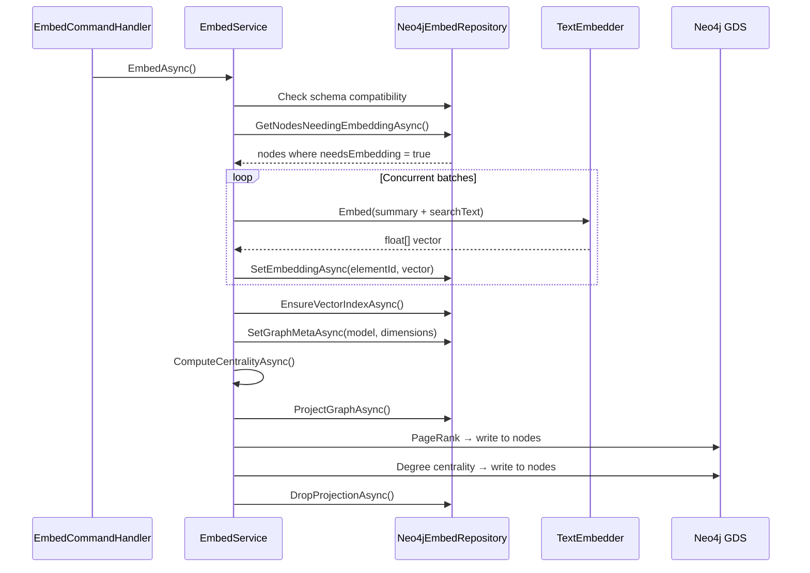
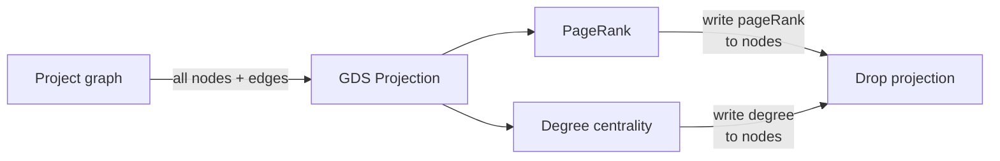

# Embed

> *Generated from the code intelligence graph.*

Generates vector embeddings from node summaries and computes graph centrality scores for search reranking. Supports concurrent batch processing with progress tracking.

## How it works



## What gets embedded

Only nodes with the `:Embeddable` label: **Class** (104), **Method** (170), **Interface** (5), **Enum** (2). Higher-level containers (Namespace, Project, Solution) are not embedded.

The embedding input is `summary + "\n" + searchText` — combining the detailed summary with keyword-dense search text. The model's `documentPrefix` is prepended if configured (e.g. `"document: "` for instruction-tuned embedding models).

## Vector index

```cypher
CREATE VECTOR INDEX code_embeddings IF NOT EXISTS
FOR (n:Embeddable)
ON (n.embedding)
OPTIONS {indexConfig: {
  `vector.dimensions`: $dimensions,
  `vector.similarity_function`: 'cosine'
}}
```

Dimensions come from the embedding model config (e.g. 1024 for `qwen3-embedding:4b`). The service checks schema compatibility — if the existing index has different dimensions, it warns about a model mismatch.

## Centrality scores

After embedding, two centrality metrics are computed via Neo4j Graph Data Science:



| Metric | What it measures | Used for |
|--------|-----------------|----------|
| **PageRank** | Recursive importance — nodes pointed to by important nodes score higher | [Search](search.md) reranking: up to +0.05 bonus |
| **Degree** | Number of relationships (in + out) | Stored for reference |

## Incremental behavior

- Nodes get `needsEmbedding = true` when their summary changes (set by the [summarize](summarize.md) stage)
- After embedding, the flag is cleared and `embeddingHash` is updated
- `--force` re-embeds all embeddable nodes
- Centrality is always recomputed (fast, depends on graph structure)

## Key components

| Component | Role |
|-----------|------|
| `EmbedService` | Orchestrates batch embedding + centrality computation |
| `Neo4jEmbedRepository` | Node queries, vector persistence, index management, GDS projections |
| `TextEmbedder` | Wraps Semantic Kernel embedding with document/query prefix support |
| `EmbedCommandHandler` | CLI handler: resolves model config, creates embedder, delegates to service |
