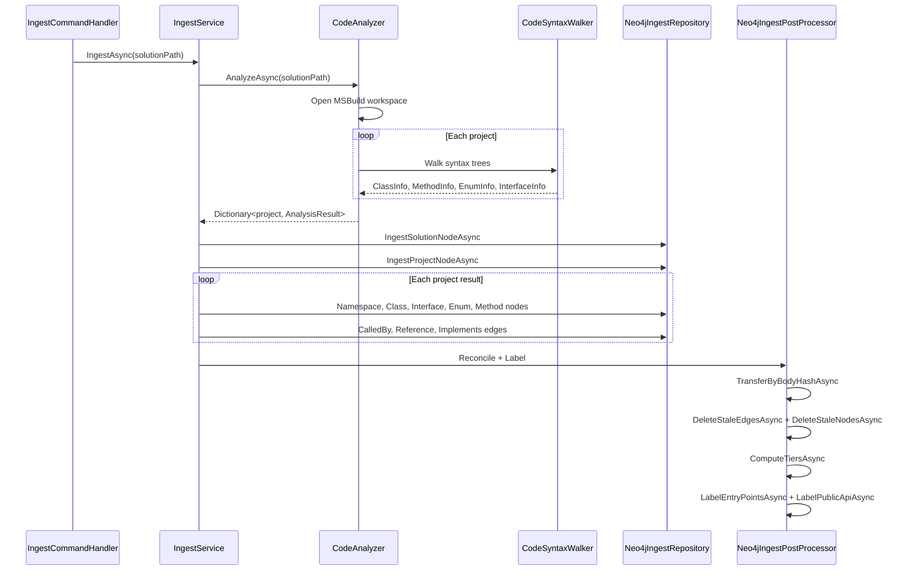
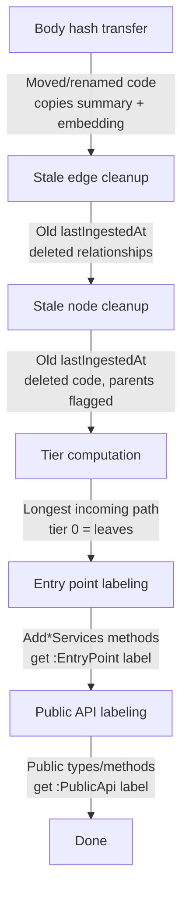

# Ingest

> *Generated from the code intelligence graph.*

Parses C# solutions using Roslyn, extracts code structure and relationships, and populates a Neo4j knowledge graph with semantic metadata. The pipeline sequences static code analysis, bulk graph ingestion, post-processing reconciliation, hierarchical tier computation, and semantic labeling.

## How it works



## Analysis

The analysis phase uses Roslyn's semantic analysis in-memory:

1. **SolutionResolver** resolves the input path (`.sln`, `.slnx`, `.csproj`, `.slnf`)
2. **CodeAnalyzer** opens an MSBuild workspace, iterates projects, and filters out test projects (`--skip-tests`) and sample projects (`--skip-samples`)
3. **CodeSyntaxWalker** — a Roslyn `CSharpSyntaxWalker` — traverses each syntax tree and extracts:
   - Classes, interfaces, enums with source text and visibility
   - Methods with signatures, return types, parameters, and full source
   - Call relationships, type references, inheritance chains
4. **SyntaxMapper** converts Roslyn syntax nodes and semantic symbols into structured records

The output is an `AnalysisResult` per project containing typed collections: namespaces, classes, interfaces, methods, enums, calls, and references.

## Graph creation

Nodes and edges are batch-upserted using `MERGE` on `fullName`. Every node gets a `lastIngestedAt` timestamp and a `bodyHash` (SHA-256 of source text) for change detection:

```cypher
UNWIND $batch AS item
MERGE (c:Class:Embeddable {fullName: item.fullName})
SET c.name = item.name,
    c.sourceText = item.sourceText,
    c.needsSummary = CASE
        WHEN c.bodyHash IS NULL OR c.bodyHash <> item.bodyHash
        THEN true ELSE c.needsSummary END,
    c.bodyHash = item.bodyHash,
    c.lastIngestedAt = $runTimestamp
```

If the body hash changed, `needsSummary` is flagged. If unchanged, the existing flag is preserved. See [incremental updates](../reference/incremental-updates.md) for the full mechanism.

## Post-processing



| Step | What it does |
|------|-------------|
| **Body hash transfer** | Finds renamed/moved code (same `bodyHash`, different `fullName`) and copies `summary`, `searchText`, `tags`, `embedding` from old to new node — avoids re-summarization |
| **Stale cleanup** | Removes edges and nodes with old `lastIngestedAt` (deleted code). Marks ancestors for re-summarization. |
| **Tier computation** | Assigns `tier` = longest incoming path depth. Leaf nodes are tier 0. See [summarize](summarize.md#tiers). |
| **Entry point labeling** | `Add*Services` / `Configure*` methods get the `:EntryPoint` label |
| **Public API labeling** | Public classes, interfaces, methods get the `:PublicApi` label |

## Key components

| Component | Role |
|-----------|------|
| `SolutionResolver` | Resolves .sln/.csproj/.slnf input paths |
| `CodeAnalyzer` | Opens MSBuild workspace, iterates projects |
| `CodeSyntaxWalker` | Roslyn syntax walker — extracts all code elements and relationships |
| `SyntaxMapper` | Converts Roslyn nodes → structured records |
| `Neo4jIngestRepository` | Batch MERGE of nodes and edges with timestamp + hash tracking |
| `Neo4jIngestPostProcessor` | Reconciliation, tier computation, labeling |
| `IngestService` | Orchestrates the full pipeline from analysis to post-processing |
