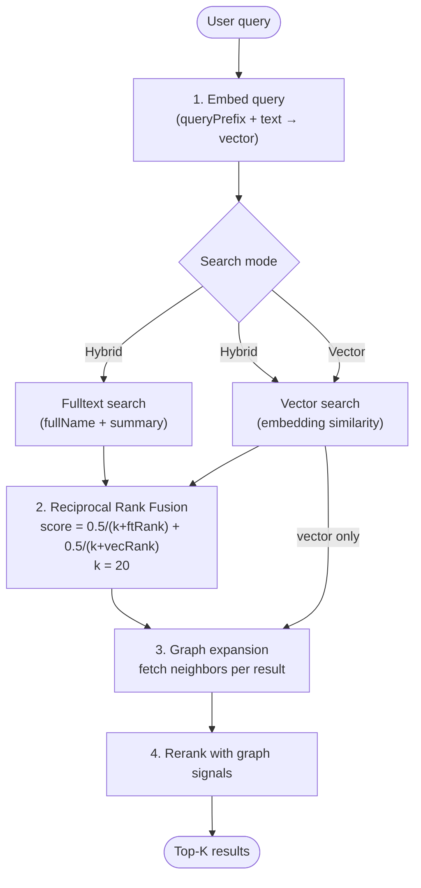
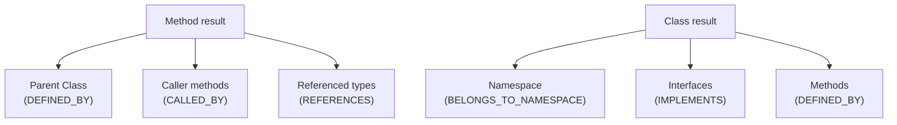

# Search

> *Generated from the code intelligence graph.*

Converts natural language queries into ranked code intelligence results through four stages: embedding, retrieval, graph expansion, and reranking. Supports both hybrid (fulltext + vector) and pure vector search modes.

## How it works



## Stage 1: Query embedding

The query is embedded using the configured model. The model's `queryPrefix` (e.g. `"query: "`) is prepended — some embedding models use different prefixes for documents vs queries to optimize retrieval.

## Stage 2: Candidate retrieval

**Hybrid mode** (default) runs fulltext and vector search in parallel against Neo4j, then merges:

```
rrfScore = 0.5 / (k + fulltextRank) + 0.5 / (k + vectorRank)
```

- **Fulltext index** searches `fullName` and `summary` — catches exact name matches
- **Vector index** searches `embedding` — catches conceptual similarity
- Nodes in both result sets get a combined score boost
- Retrieves `topK × 2` candidates to leave headroom for reranking

**Vector mode** (`--mode Vector`) skips fulltext — useful for purely conceptual queries.

## Stage 3: Graph expansion

For each candidate, immediate neighbors are fetched via all relationship types:



Neighbors appear as indented sub-results in output, showing relationship type and summary.

## Stage 4: Reranking

Graph-based bonuses are added to the retrieval score:

| Signal | Bonus | Why |
|--------|-------|-----|
| Shared neighbors | +0.02 per shared neighbor | Co-referenced nodes are likely related |
| PageRank centrality | up to +0.05 | Central/important nodes rank higher |
| EntryPoint label | +0.10 | DI registration methods are high-value navigation targets |

Results sorted by final score, truncated to `topK`.

## Example

```
$ dotnet run -- search "docker container management" --top 3

Score    Type    Name                                               Summary
0.3929  Method  Neo4jContainerClient.TryInspectAsync(string)       Resilient container inspection...
         └─ CALLED_BY  ResolveAsync          Resolves Neo4j database connection...
         └─ CALLED_BY  GetStatusAsync        Resilient Neo4j container status...
0.3561  Method  Neo4jContainerClient.CollectAllNamesAsync()        Collects all container identifiers...
         └─ CALLED_BY  ListWithStatusAsync   Orchestrates container status...
0.3516  Method  Neo4jContainerClient.ParseBoltPort(...)            Extracts Neo4j port from Docker...
         └─ CALLED_BY  ResolveAsync          Resolves Neo4j database connection...
```

## Key components

| Component | Role |
|-----------|------|
| `SearchService` | Orchestrates: embed → retrieve → expand → rerank |
| `Neo4jSearchRepository` | Cypher queries for vector search, fulltext search, neighbor expansion |
| `SearchResult` | Result record with score, labels, neighbors, centrality |
| `SearchCommandHandler` | CLI handler: loads model config from graph metadata, delegates to service |
| `SearchMode` | Enum: `Hybrid` or `Vector` |
