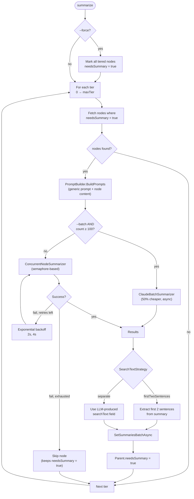
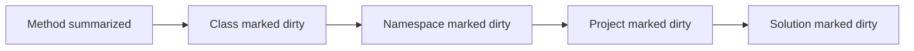

# Summarize

> *Generated from the code intelligence graph.*

Generates LLM summaries for every node in the graph, processing bottom-up through tiers so parent summaries incorporate children's context. Supports concurrent and batch execution strategies with automatic retry and resumability.

## How it works



## Tiers

A node's tier = the length of the longest chain of incoming relationships. Computed by the [ingest](ingest.md) post-processor:

```cypher
MATCH (n)
OPTIONAL MATCH path = ()-[*1..20]->(n)
WITH n, COALESCE(max(length(path)), 0) AS tier
SET n.tier = tier
```

| Tier | Count | Typical contents |
|------|-------|-----------------|
| 0 | 130 | Leaf methods, standalone classes, enums |
| 1-2 | 95 | Classes with children, small namespaces |
| 3-5 | 61 | Feature namespaces, service classes, sub-namespaces |
| 6-8 | 13 | Top-level feature namespaces (Search, Summarize, Database, Embed) |
| 10 | 1 | Solution |
| 11 | 1 | Project |

Processing tier 0 first ensures that when tier 1 runs, all child summaries are already available as context in the prompt.

## Prompt

All node types use a single generic prompt — no per-type variants. The LLM is asked to:

1. Start with a 2-sentence summary (what it does, technologies, problem solved)
2. Explain logic flow, algorithms, component interactions, non-obvious behavior
3. Assign 1-3 tags from a fixed set (`DATABASE`, `API`, `PIPELINE`, `DI_REGISTRATION`, etc.)

No sentence limit — the LLM decides length based on complexity.

The **content** passed varies by node type:

| Node type | Content included |
|-----------|-----------------|
| Method | Signature + full source code |
| Class / Interface | Source text + child summaries |
| Enum | Declaration with members |
| Namespace / Project / Solution | Name + child summaries (cascading context) |

Example — summarizing a namespace at tier 6:

```
Analyze this C# code for a code intelligence graph.
Start with a 2-sentence summary...

GraphRagCli.Features.Search

Components:
- SearchService: Executes intelligent code search by converting natural language...
- Neo4jSearchRepository: Enables semantic and fulltext search over a code knowledge graph...
- SearchCommandHandler: Executes semantic code search against a Neo4j knowledge graph...
```

Override with `--prompt "custom instruction"`.

## Execution strategies

| Strategy | When used | Behavior |
|----------|-----------|----------|
| `ConcurrentNodeSummarizer` | Default | Semaphore-based concurrency (from [model config](../reference/model-configuration.md)), 2 retries with exponential backoff, progress bar with ETA |
| `ClaudeBatchSummarizer` | `--batch` + tier ≥ 100 nodes | Submits to Claude Batch API (50% cost reduction), polls for completion. Tiers < 100 nodes fall back to concurrent. |

Failed nodes keep `needsSummary = true` — re-running picks up where it left off.

## Upward propagation

After saving summaries, every node's direct parents get `needsSummary = true`:



This ensures a leaf change cascades re-summarization through the entire ancestor chain. The next tier in the same run picks these up automatically.

## Force mode and resumability

`--force` is a pre-processing step, not an inline filter:

```cypher
MATCH (n) WHERE n.tier IS NOT NULL
SET n.needsSummary = true
```

This makes `--force` resumable — if the run fails mid-way, re-running (without `--force`) processes only the remaining dirty nodes.

## Key components

| Component | Role |
|-----------|------|
| `SummarizeService` | Orchestrates tier-by-tier processing, coordinates strategies |
| `PromptBuilder` | Builds prompts: generic instruction + node-specific content |
| `ConcurrentNodeSummarizer` | Parallel execution with retry and progress tracking |
| `ClaudeBatchSummarizer` | Claude Batch API integration with poll loop |
| `Summarizer` | Single-node summarization via Semantic Kernel structured output |
| `Neo4jSummarizeRepository` | Reads dirty nodes, writes summaries, propagates parent flags |
| `SummaryResult` | Structured output: `summary`, `tags`, optional `searchText` |
