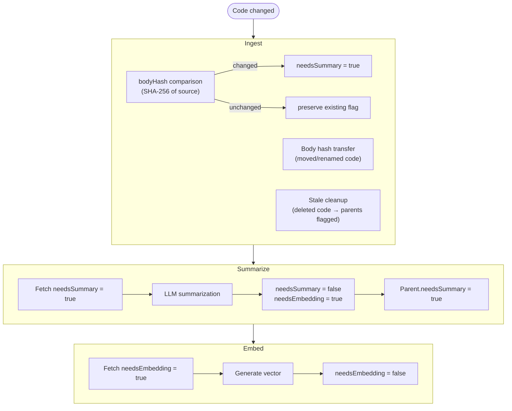

# Incremental updates

> *Generated from the code intelligence graph.*

The system is designed for repeated runs where only changed code needs reprocessing. Each stage tracks changes and propagates invalidation upward through the graph.

## Change detection flow



## Ingest: timestamp + body hash

Every node and edge gets a `lastIngestedAt` timestamp. Change detection uses `bodyHash`:

```cypher
SET c.needsSummary = CASE
    WHEN c.bodyHash IS NULL OR c.bodyHash <> item.bodyHash
    THEN true ELSE c.needsSummary END,
    c.bodyHash = item.bodyHash,
    c.lastIngestedAt = $runTimestamp
```

### Body hash transfer

Finds renamed/moved code — same `bodyHash`, different `fullName` — and copies expensive properties:

```cypher
MATCH (stale) WHERE stale.lastIngestedAt < $runTimestamp AND stale.bodyHash IS NOT NULL
MATCH (fresh) WHERE fresh.lastIngestedAt >= $runTimestamp AND fresh.bodyHash = stale.bodyHash
SET fresh.summary = stale.summary, fresh.searchText = stale.searchText,
    fresh.tags = stale.tags, fresh.embedding = stale.embedding
```

### Stale cleanup

- Edges with old `lastIngestedAt` → deleted (removed relationships)
- Nodes with old `lastIngestedAt` → deleted (removed code), ancestors marked dirty

### Tier recomputation

Tiers are recomputed after every ingest since the graph structure may have changed.

## Summarize: needsSummary flag

After summarizing a node:

1. `needsSummary = false`
2. `needsEmbedding = true` (summary changed → embedding stale)
3. All direct parents get `needsSummary = true`

```cypher
UNWIND $elementIds AS eid
MATCH (n) WHERE elementId(n) = eid
MATCH (n)-->(parent)
SET parent.needsSummary = true
```

The `--force` flag marks all tiered nodes dirty upfront as a pre-processing step, making it resumable — re-running without `--force` picks up remaining dirty nodes.

## Embed: needsEmbedding flag

Fetches nodes where `needsEmbedding = true` (or all if `--force`). After embedding, the flag is cleared. Centrality is always recomputed.

## What triggers re-processing

| Change | Ingest | Summarize | Embed |
|--------|--------|-----------|-------|
| Method body changed | `needsSummary = true` on method | Method re-summarized, parent flagged | Method re-embedded |
| Class renamed (same body) | Body hash transfer: properties copied | No re-summarization needed | No re-embedding needed |
| Method deleted | Stale node removed, parent flagged | Parent re-summarized | Parent re-embedded |
| New method added | New node with `needsSummary = true` | Method summarized, parent flagged | Method embedded |
| No code changes | No flags set | Nothing to process | Nothing to process |

## Typical workflow

```bash
# Developer changes some code, then:
dotnet run -- ingest /path/to/Solution.sln    # only changed nodes flagged
dotnet run -- summarize                        # only dirty nodes + propagated parents
dotnet run -- embed                            # only nodes with new summaries
```
