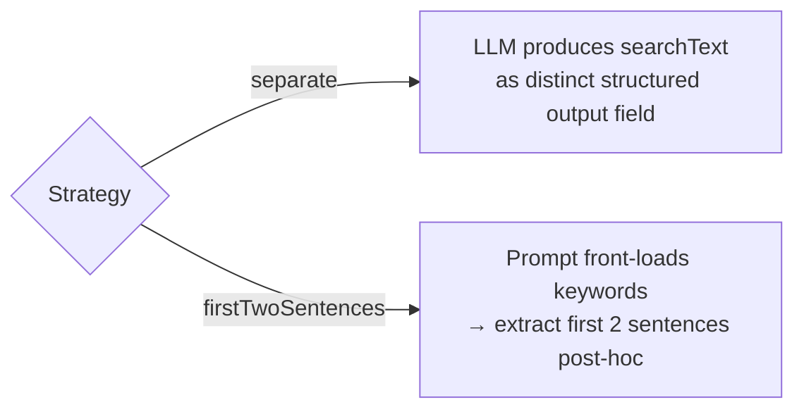

# Model configuration

> *Generated from the code intelligence graph.*

AI models are configured in `~/.graphragcli/models.json`. Seeded from embedded defaults on first run, managed via the `models` CLI command.

## Structure

```json
{
  "embedding": {
    "qwen3-embedding:4b": {
      "provider": "ollama",
      "dimensions": 1024,
      "documentPrefix": "document: ",
      "queryPrefix": "query: "
    }
  },
  "summarize": {
    "qwen3-coder": {
      "provider": "ollama",
      "maxPromptChars": 8000,
      "concurrency": 2,
      "searchTextStrategy": "firstTwoSentences"
    },
    "claude-haiku-4-5-20251001": {
      "provider": "claude",
      "maxPromptChars": 30000,
      "concurrency": 30,
      "searchTextStrategy": "separate"
    }
  },
  "defaults": {
    "embedding": "qwen3-embedding:4b",
    "summarize": "qwen3-coder"
  }
}
```

## Providers

| Provider | Embedding | Summarization | Notes |
|----------|-----------|---------------|-------|
| `ollama` | Local inference | Local inference, 5min HTTP timeout | Free, runs locally |
| `claude` | Not supported | Anthropic API (real-time + batch) | Requires `ANTHROPIC_API_KEY` |

## Embedding model fields

| Field | Description |
|-------|-------------|
| `provider` | `ollama` |
| `dimensions` | Vector dimensions (must match model output) |
| `documentPrefix` | Prepended when embedding documents |
| `queryPrefix` | Prepended when embedding search queries |

## Summarize model fields

| Field | Description |
|-------|-------------|
| `provider` | `ollama` or `claude` |
| `maxPromptChars` | Truncate prompts beyond this length |
| `concurrency` | Max parallel summarization requests |
| `searchTextStrategy` | How `searchText` is generated (see below) |

## SearchText strategy

Controls how the `searchText` property (keyword-dense text for vector search) is produced:



| Strategy | Best for | How it works |
|----------|----------|-------------|
| `separate` | Claude | Structured output schema includes `searchText`. Claude reliably produces distinct, keyword-dense text. |
| `firstTwoSentences` | Ollama | Prompt instructs front-loading keywords. After generation, first two sentences extracted as `searchText`. |

This exists because Ollama models tend to produce `searchText` identical to the summary when asked for it as a separate field.

## CLI management

```bash
dotnet run -- models list
dotnet run -- models add summarize my-model --provider ollama --max-prompt-chars 8000
dotnet run -- models add embedding my-embedder --provider ollama --dimensions 768
dotnet run -- models default summarize claude-haiku-4-5-20251001
dotnet run -- models remove my-model
```

## Key components

| Component | Role |
|-----------|------|
| `ModelConfigLoader` | Load/save `models.json`, seed from embedded defaults |
| `ModelsConfig` | Root config record with embedding + summarize dictionaries |
| `SummarizeModelConfig` | Per-model: provider, maxPromptChars, concurrency, searchTextStrategy |
| `EmbeddingModelConfig` | Per-model: provider, dimensions, prefixes |
| `KernelFactory` | Creates provider-specific clients from config |
